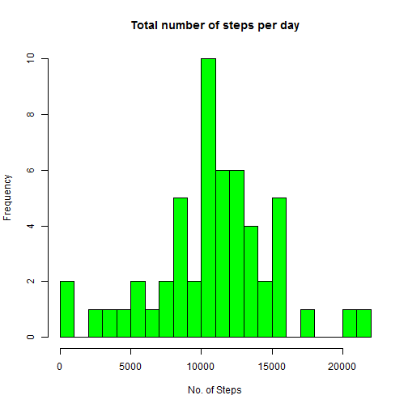
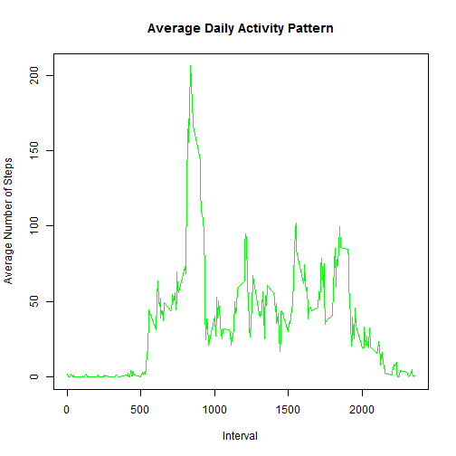
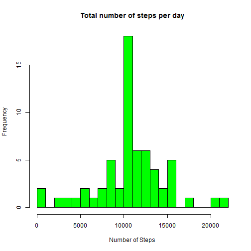
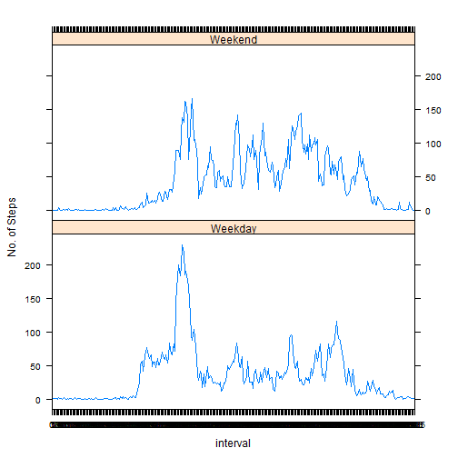

```r
---
title: "Personal Movement Analysis of Data Collected from Activity Monitoring Devices"
author: "JBB"
date: "March 3, 2017"
output: html_document
---
```

```
## Error: <text>:8:0: unexpected end of input
## 6: ---
## 7: 
##   ^
```


## Introduction

It is now possible to collect a large amount of data about personal movement using activity monitoring devices such as a Fitbit, Nike Fuelband, or Jawbone Up. These type of devices are part of the "quantified self" movement - a group of enthusiasts who take measurements about themselves regularly to improve their health, to find patterns in their behavior, or because they are tech geeks. But these data remain under-utilized both because the raw data are hard to obtain and there is a lack of statistical methods and software for processing and interpreting the data.

This assignment makes use of data from a personal activity monitoring device. This device collects data at 5 minute intervals through out the day. The data consists of two months of data from an anonymous individual collected during the months of October and November, 2012 and include the number of steps taken in 5 minute intervals each day.

### Step 1: Loading and preprocessing the data

Load the data (i.e. read.csv())

```r
data <- read.csv("activity.csv", header = TRUE, sep = ",", na.strings = "NA")
summary(data)
```

```
##      steps                date          interval     
##  Min.   :  0.00   2012-10-01:  288   Min.   :   0.0  
##  1st Qu.:  0.00   2012-10-02:  288   1st Qu.: 588.8  
##  Median :  0.00   2012-10-03:  288   Median :1177.5  
##  Mean   : 37.38   2012-10-04:  288   Mean   :1177.5  
##  3rd Qu.: 12.00   2012-10-05:  288   3rd Qu.:1766.2  
##  Max.   :806.00   2012-10-06:  288   Max.   :2355.0  
##  NA's   :2304     (Other)   :15840
```

```r
str(data)
```

```
## 'data.frame':	17568 obs. of  3 variables:
##  $ steps   : int  NA NA NA NA NA NA NA NA NA NA ...
##  $ date    : Factor w/ 61 levels "2012-10-01","2012-10-02",..: 1 1 1 1 1 1 1 1 1 1 ...
##  $ interval: int  0 5 10 15 20 25 30 35 40 45 ...
```

Transform the data into a suitable format  

```r
data$date <- as.Date(data$date, format = "%Y-%m-%d")
data$interval <- factor(data$interval)
```


### Step 2: What is mean total number of steps taken per day?

```r
NA_index <- is.na(as.character(data$steps))
datat_without_NA <- data[!NA_index,]
head(datat_without_NA)
```

```
##     steps       date interval
## 289     0 2012-10-02        0
## 290     0 2012-10-02        5
## 291     0 2012-10-02       10
## 292     0 2012-10-02       15
## 293     0 2012-10-02       20
## 294     0 2012-10-02       25
```

Calculate the total number of steps taken per day

```r
steps_daily <- aggregate(steps ~ date, data = datat_without_NA, sum)
colnames(steps_daily) <- c("date", "steps")
```

Make a histogram of the total number of steps taken each day

```r
hist(as.numeric(steps_daily$steps), breaks = 20, col = "green", xlab = "No. of Steps", main= "Total number of steps per day")
```



Calculate and report the mean and median of the total number of steps taken per day

```r
mean(steps_daily$steps)
```

```
## [1] 10766.19
```

```r
median(steps_daily$steps)
```

```
## [1] 10765
```

### Step 3: What is the average daily activity pattern?

1. Make a time series plot (i.e. type = "l") of the 5-minute interval (x-axis) and the average number of steps taken, averaged across all days (y-axis)

```r
steps_per_interval <- aggregate(datat_without_NA$steps, by=list(interval=datat_without_NA$interval), FUN=mean)
colnames(steps_per_interval) <- c("interval", "average_steps")
plot(as.integer(levels(steps_per_interval$interval)), steps_per_interval$average_steps, type="l",
     xlab = "Interval", ylab = "Average Number of Steps", main = "Average Daily Activity Pattern",  col ="green")
```



2. Which 5-minute interval, on average across all the days in the dataset, contains the maximum number of steps?

```r
max_steps <- max(steps_per_interval$average_steps)
intervale_max_steps<-steps_per_interval[which.max(steps_per_interval$average_steps),]$interval
intervale_max_steps
```

```
## [1] 835
## 288 Levels: 0 5 10 15 20 25 30 35 40 45 50 55 100 105 110 115 120 ... 2355
```

### Step 4: Imputing missing values
Note that there are a number of days/intervals where there are missing values (coded as NA). The presence of missing days may introduce bias into some calculations or summaries of the data.

1. Calculate and report the total number of missing values in the dataset (i.e. the total number of rows with NAs)
 "steps" variable:

```r
sum(is.na(as.character(data$steps)))
```

```
## [1] 2304
```

 "date" variable:

```r
sum(is.na(as.character(data$date)))
```

```
## [1] 0
```

 "interval" variable:

```r
sum(is.na(as.character(data$interval)))
```

```
## [1] 0
```

total number of missing values in the dataset is 2304.

2. Devise a strategy for filling in all of the missing values in the dataset. The strategy does not need to be sophisticated. For example, you could use the mean/median for that day, or the mean for that 5-minute interval, etc.

```r
NA_index <- which(is.na(as.character(data$steps)))
complete_data <- data
#Imputing missing values using the mean for that 5-minute interval
complete_data[NA_index, ]$steps<-unlist(lapply(NA_index, FUN=function(NA_index){
                steps_per_interval[data[NA_index,]$interval==steps_per_interval$interval,]$average_steps
                }))
```

3. Create a new dataset that is equal to the original dataset but with the missing data filled in.

```r
summary(complete_data)
```

```
##      steps             date               interval    
##  Min.   :  0.00   Min.   :2012-10-01   0      :   61  
##  1st Qu.:  0.00   1st Qu.:2012-10-16   5      :   61  
##  Median :  0.00   Median :2012-10-31   10     :   61  
##  Mean   : 37.38   Mean   :2012-10-31   15     :   61  
##  3rd Qu.: 27.00   3rd Qu.:2012-11-15   20     :   61  
##  Max.   :806.00   Max.   :2012-11-30   25     :   61  
##                                        (Other):17202
```

```r
str(complete_data)
```

```
## 'data.frame':	17568 obs. of  3 variables:
##  $ steps   : num  1.717 0.3396 0.1321 0.1509 0.0755 ...
##  $ date    : Date, format: "2012-10-01" "2012-10-01" ...
##  $ interval: Factor w/ 288 levels "0","5","10","15",..: 1 2 3 4 5 6 7 8 9 10 ...
```

4. Make a histogram of the total number of steps taken each day and Calculate and report the mean and median total number of steps taken per day. Do these values differ from the estimates from the first part of the assignment? What is the impact of imputing missing data on the estimates of the total daily number of steps?

```r
steps_daily_complete <- aggregate(steps ~ date, data = complete_data, sum)
#Adding column names to the created data frame
colnames(steps_daily_complete) <- c("date", "steps")

#Making the histogram
hist(as.numeric(steps_daily_complete$steps), breaks = 20, col = "green", xlab = "Number of Steps", main= "Total number of steps per day")
```



5. Calculating the mean and median total number of steps taken per day for the complete dataset:

```r
mean(steps_daily_complete$steps)
```

```
## [1] 10766.19
```

```r
median(steps_daily_complete$steps)
```

```
## [1] 10766.19
```

The mean of the complete dataset (10766) is equal to the mean of the dataset without missing values. The median of the complete dataset has shifted from 10765 to 10766. Therefore, the mean and median for the complete dataset are almost identical.

### Step 5: Are there differences in activity patterns between weekdays and weekends?

```r
complete_data$day <- as.factor(weekdays(complete_data$date))
complete_data$is_weekday <- ifelse(!(complete_data$day %in% c("Saturday","Sunday")), TRUE, FALSE) 

weekdays_data <- complete_data[complete_data$is_weekday,]
steps_per_interval_weekdays <- aggregate(weekdays_data$steps, by=list(interval=weekdays_data$interval), FUN=mean)

weekends_data <- complete_data[!complete_data$is_weekday,]
steps_per_interval_weekends <- aggregate(weekends_data$steps, by=list(interval=weekends_data$interval), FUN=mean)

colnames(steps_per_interval_weekdays) <- c("interval", "average_steps")
colnames(steps_per_interval_weekends) <- c("interval", "average_steps")
steps_per_interval_weekdays$day <- "Weekday"
steps_per_interval_weekends$day <- "Weekend"

week_data <- rbind(steps_per_interval_weekends, steps_per_interval_weekdays)
week_data$day <- as.factor(week_data$day)

library(lattice)
xyplot(average_steps ~  interval | day, data = week_data, layout = c(1,2), type ="l", ylab="No. of Steps")
```


```

